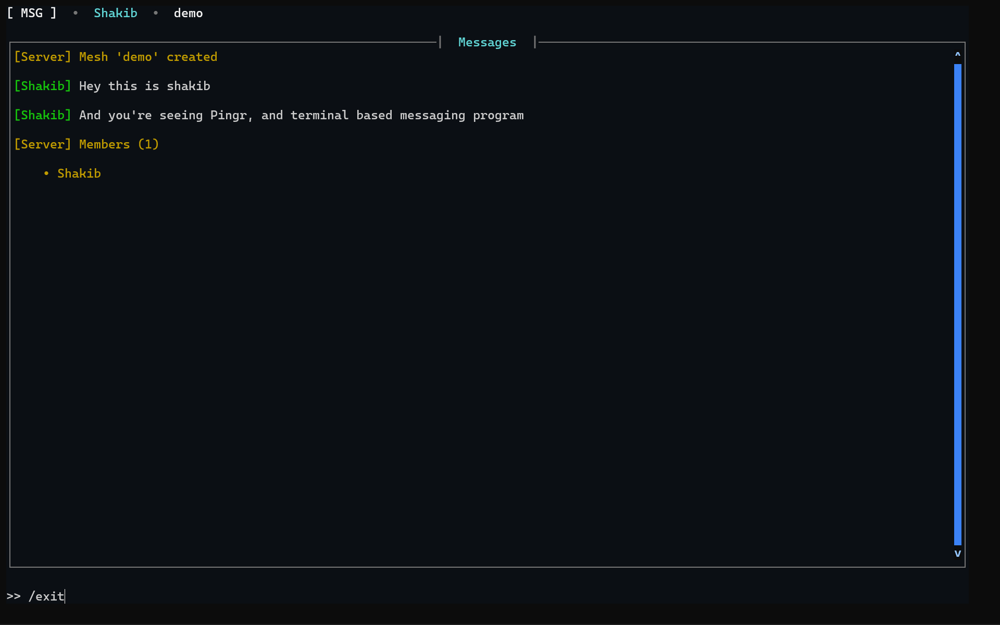

# Pingr

**Chat in your terminal. No browser, no bloat — just a mesh, a password, and a prompt.**

Pingr is a lightweight terminal chat app inspired by the hacker-in-the-terminal aesthetic from *Mr. Robot*. Spin up a **mesh** (a chat room) with a name and password, share the credentials with your friends, and talk in real time — all from a clean, colorful TUI built with `prompt_toolkit` and powered by WebSockets.

<!--
📸 SCREENSHOT AREA
Add a screenshot or GIF of the app here, e.g.:


Good shots to include:
1. The mesh-selection menu (Start Mesh / Join Mesh)
2. An active chat session with a few messages and the member count in the header
3. The /members command output
-->



---

## ✨ Features

- **Zero-friction rooms** — create a "mesh" with a name + password, no accounts, no sign-up
- **Real-time messaging** over WebSockets
- **Clean terminal UI** — colored usernames, server messages, and a live member count, built with `prompt_toolkit`
- **Slash commands** — check who's online or leave the mesh without breaking flow
- **Self-hosted server included** — run your own instance anywhere, or point at a hosted one
- **No local storage, no accounts** — usernames and meshes live only for the session

---

## 📦 Installation

```bash
pip install pingr
```

## 🚀 Usage

Start the client:

```bash
msg
```

You'll be prompted for:

1. **Your name** — your display name for the session
2. **Start Mesh** or **Join Mesh** — use the arrow keys + Enter to choose
3. **Mesh name** and **password** — create a new mesh or join an existing one with matching credentials

Once connected, you're in the chat:

```
[ MSG ]  •  yourname  •  mesh-name       
──────────────────────────────────────────────
[Server] yourname joined the mesh
[alex] hey, anyone around?
[you] yeah, what's up

>> 
```

### In-chat commands

| Command    | Description                                            |
|------------|--------------------------------------------------------|
| `/help`    | Show available commands, shortcuts, and syntax guide   |
| `/copy`    | Copy the latest message to your clipboard              |
| `/copyall` | Copy the entire chat transcript to your clipboard      |
| `/clear`   | Clear local chat view                                  |
| `/members` | List everyone currently in the mesh                    |
| `/exit`    | Leave the mesh and close the connection                |

### Keyboard Shortcuts & Modes

- **Switch Modes (`Tab` / `Shift+Tab`)**:
  - **`[ ⌨ INPUT MODE ]`**: Type messages and run slash commands.
  - **`[ 📋 CHAT BROWSE & COPY MODE ]`**: Navigate chat history and copy text.
- **In Browse Mode**:
  - `c` or `Ctrl+C`: Copy selected text (or full message under cursor) to clipboard
  - `l`: Copy the latest message to clipboard
  - `a`: Copy the entire chat transcript to clipboard
  - `Shift + Arrows` or mouse click-drag: Select text to copy
  - `Enter` / `i` / `Esc`: Jump back to typing mode
- **Scrolling**: `Page Up` / `Page Down` to scroll, `Home` / `End` to jump to top or bottom.

### Rich Text Formatting

Pingr supports inline Markdown-style syntax:
- `**bold text**`
- `*italic text*`
- `` `inline code` ``
- `> blockquote`
- `@username` mentions
- `https://...` link styling

---

## 🖥️ Self-hosting the server

Pingr's client connects to a WebSocket server (by default a hosted instance on [Render](https://render.com)). You can run your own:

```bash
python server.py
```

The server reads its port from the `PORT` environment variable (defaults to `5000`) and listens on `0.0.0.0`. To point the client at your own server, update `SERVER_URL` in `main.py` to your server's WebSocket URL (`ws://` or `wss://`).

### Server-side rules

- Usernames: up to 24 characters, must be unique while connected
- Mesh names: up to 32 characters, case-insensitive
- Passwords: up to 128 characters
- Messages: 1–2000 characters
- A mesh is automatically deleted once its last member leaves

---

## 🏗️ How it works

Pingr uses a simple pipe-delimited text protocol over WebSockets:

- `START|<mesh>|<password>` — create a new mesh
- `JOIN|<mesh>|<password>` — join an existing mesh
- `MSG|<text>` — send a chat message
- `CMD|members` / `CMD|exit` — client commands
- `CHAT|<sender>|<text>`, `SERVER|<text>`, `COUNT|<n>`, `MEMBERS|<n>|<name1>|<name2>...` — server broadcasts

The server (`server.py`) is a single `asyncio` event loop using the [`websockets`](https://websockets.readthedocs.io/) library, with an `asyncio.Lock` guarding shared mesh state so joins, leaves, and broadcasts stay consistent under concurrent connections.

The client (`main.py`) connects via `websockets.sync.client`, runs a background thread to receive and render incoming messages, and uses [`prompt_toolkit`](https://python-prompt-toolkit.readthedocs.io/) to build the full-screen TUI — menu navigation, a scrollable chat pane, and a live input field.

---

## 📁 Project structure

```
pingr/
├── tmsg/
│   ├── __init__.py
│   └── main.py        # CLI entrypoint (`msg`) — the terminal client
├── server.py           # WebSocket chat server
├── pyproject.toml
├── requirements.txt
└── README.md
```

---

## 🛠️ Tech stack

- Python 3
- [`websockets`](https://pypi.org/project/websockets/) — async WebSocket server & sync client
- [`prompt_toolkit`](https://pypi.org/project/prompt-toolkit/) — full-screen terminal UI

---

## 🤝 Contributing

Issues and pull requests are welcome. If you spot a bug or have an idea for a feature (DMs? message history? mesh discovery?), feel free to open an issue.

---

## 📜 License

MIT — do whatever you want with it, just don't blame me if your mesh gets raided :)

---
**In your terminal** <br>
`pip install pingr`<br>
`msg`<br>
and have Fun with your Friends!